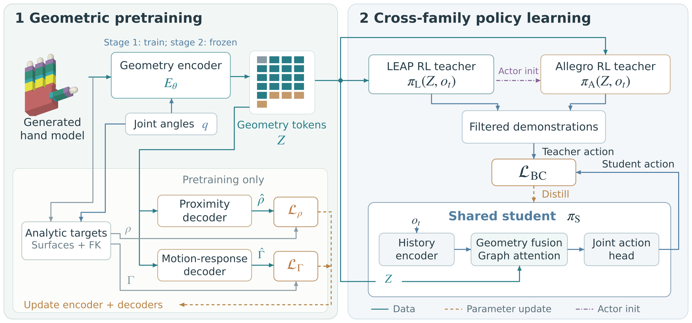
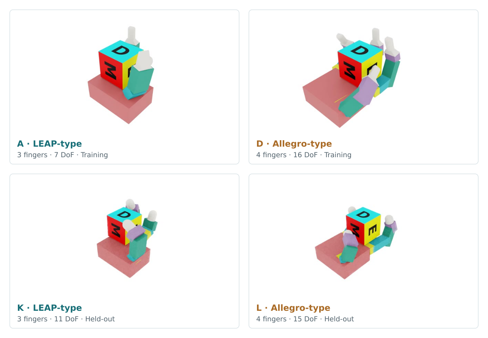
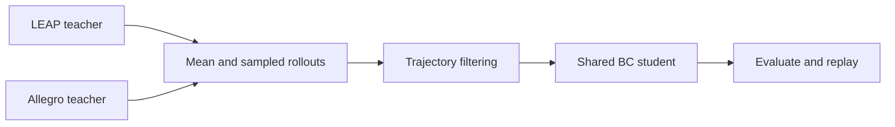

# AnyMani

**Cross-Embodiment In-Hand Rotation via Contact Geometry Learning**

Aochen He · Gangshan Jing — Chongqing University

[Project page](https://riemac.github.io/AnyMani/) · [Models and assets](https://github.com/riemac/AnyMani/releases/tag/v1.0.0)

AnyMani learns a geometric representation of hand surfaces and their joint-driven motion. A shared student policy learns from LEAP- and Allegro-type teachers to rotate a cube across generated hands with different structures and dimensions.



## Replay a pretrained policy

### 1. Install

Running AnyMani requires Linux, Python 3.11, an NVIDIA GPU, and the Isaac Sim 5.1 / Isaac Lab environment specified below. The release uses PyTorch 2.7.0 with CUDA 12.8. The quick replay uses one simulated hand. Demonstration collection uses 2,048 parallel environments.

The reader workflow was tested on Ubuntu 24.04 with an RTX 5070 Ti (16 GB) and NVIDIA driver 580.159.03.

With [uv](https://docs.astral.sh/uv/getting-started/installation/) installed:

```bash
git clone https://github.com/riemac/AnyMani.git
cd AnyMani
uv venv --python 3.11 --seed
source .venv/bin/activate
python -m pip install torch==2.7.0 torchvision==0.22.0 \
  --index-url https://download.pytorch.org/whl/cu128 --resume-retries 30
python -m pip install "isaacsim[all,extscache]==5.1.0" \
  --extra-index-url https://pypi.nvidia.com --resume-retries 30
git init .deps/IsaacLab
git -C .deps/IsaacLab remote add origin https://github.com/isaac-sim/IsaacLab.git
git -C .deps/IsaacLab fetch --depth=1 origin 47c9f95eeab90dc3611981d894d59f163191f5b1
git -C .deps/IsaacLab checkout --detach FETCH_HEAD
python -m pip install -e .deps/IsaacLab/source/isaaclab \
  -e .deps/IsaacLab/source/isaaclab_assets \
  -e .deps/IsaacLab/source/isaaclab_tasks \
  -e .deps/IsaacLab/source/isaaclab_rl \
  -e ".[geometry,simulation]" --resume-retries 30
```

If you already have this Isaac Sim / Isaac Lab environment, activate it and run `python -m pip install -e ".[geometry,simulation]"` from the AnyMani repository root. See the [Isaac Lab installation guide](https://isaac-sim.github.io/IsaacLab/main/source/setup/installation/pip_installation.html) for system requirements and alternative setup options.

All commands below run from the **AnyMani repository root** with this environment active.

### 2. Download models and hand assets

```bash
python scripts/download.py
```

This downloads approximately 33 MB to `data/` (a 24.7 MB model archive and a 7.9 MB asset archive) and verifies checksums before extraction. The model package contains the geometry encoder, both family teachers, and the shared Ours student. The asset package contains 256 training hands, 128 held-out hand records (including five recorded initialization failures, yielding 379 ready hands in total), and their corresponding initial-grasp catalogs.

### 3. Watch the student

```bash
python scripts/replay.py --real-time
```

On its first launch, Isaac Sim prompts you to accept its license in the terminal. A simulator window then opens showing a generated LEAP-type hand rotating a cube for 30 seconds. To replay a held-out Allegro hand:

```bash
python scripts/replay.py --cohort allegro_right_variant --asset-index 0 --real-time
```

Each replay logs its selected asset, model identity, and rollout trajectory into a directory under `logs/benchmarks/heterogeneous_rotation/`. Add `--record-video` to save an MP4, or use `--headless` when a visual window is not needed. The [project page](https://riemac.github.io/AnyMani/#rotation) provides browser-based replays and an interactive geometry viewer.



## Train the shared student

The student policy is trained using offline behavior cloning. Because the download includes the pretrained LEAP and Allegro teachers, you can collect demonstration datasets directly without retraining teachers.



### 1. Collect teacher demonstrations

```bash
python scripts/collect.py --output outputs/demonstrations
```

This runs four collection jobs in paper order: LEAP mean, LEAP sampled, Allegro mean, and Allegro sampled. Each job runs 128 hands × 16 replicas for 600 policy steps, retaining all state frames and recording BC samples every four steps. It outputs `leap_mean.h5`, `leap_sample.h5`, `allegro_mean.h5`, and `allegro_sample.h5`, alongside per-run summaries. Ensure approximately 12 GB of free disk space is available for these four datasets.

### 2. Train and export

```bash
python scripts/train_student.py \
  --demonstrations outputs/demonstrations \
  --output outputs/student
```

The default uses seed 42, 16,750 optimizer updates arranged as 50 rounds of 335 updates, Adam learning rate 0.0003, and FP32 training with TF32 disabled. The release fixes CPU reductions and CUDA kernels for repeatable training. Trajectories are admitted only if they last 30 seconds, complete at least half a net turn, and maintain a directionality of at least 0.7. Validation uses separate replicas.

The frozen sampler requests 2,048 indices per update. An indexing mismatch between source labels and training views discards some draws, giving an expected batch of approximately 1,509 training examples on these data and uneven hand weights. All three paper variants use this same routine.

The selected checkpoint is saved to `outputs/student/best.pt`; `actor.ts` and `actor.ts.json` provide the TorchScript actor and its input specification. `training-report.json` and `metrics.jsonl` record training progress and validation-based model selection.

### 3. Evaluate and replay your student

```bash
python scripts/evaluate.py --population unseen \
  --student-checkpoint outputs/student/best.pt \
  --student-torchscript outputs/student/actor.ts \
  --output-dir outputs/student-evaluation
python scripts/replay.py --cohort allegro_right_variant \
  --student-checkpoint outputs/student/best.pt \
  --student-torchscript outputs/student/actor.ts --real-time
```

Evaluation runs 16 replicas per hand using the paper's 30-second first-trajectory protocol. `cohort-summary.json` reports hand success, safe completion, and mean per-hand net turns. Success requires at least one median net turn, directionality of at least 0.7, and at least 12 safe trials out of 16. Its denominator retains all 128 held-out hands, including the five initialization failures. Omit `--student-checkpoint` and `--student-torchscript` to evaluate the downloaded reference student. Pass `--population train` to benchmark across the 256 training hands.

## Further details

- [Generate assets and prepare initial grasps](docs/assets.md)
- [Pretrain the geometry encoder](docs/pretraining.md)
- [Release manifest and download checksums](release.json)
- [Third-party licenses and attribution](THIRD_PARTY_NOTICES.md)

The full generated asset bank and historical demonstrations are omitted from the default download; the supplied encoder, teachers, and control assets are sufficient for the replay and shared-student workflows above.

## Citation

```bibtex
@misc{he2026anymani,
  title  = {AnyMani: Cross-Embodiment In-Hand Rotation via Contact Geometry Learning},
  author = {He, Aochen and Jing, Gangshan},
  year   = {2026},
  url    = {https://riemac.github.io/AnyMani/}
}
```

## License

Original code is released under the [MIT license](LICENSE). Included upstream assets and code retain their [licenses and attribution](THIRD_PARTY_NOTICES.md).
