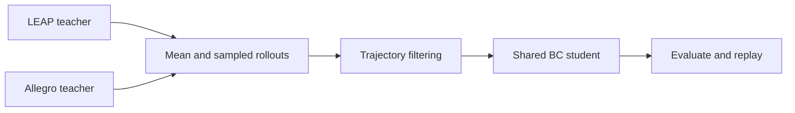

# AnyMani

**Cross-Embodiment In-Hand Rotation via Contact Geometry Learning**

Aochen He · Gangshan Jing — Chongqing University

[Project page](https://riemac.github.io/AnyMani/) · [Models and assets](https://github.com/riemac/AnyMani/releases/tag/v1.0.0)

AnyMani learns a geometric representation of a hand's surfaces and their joint-driven motion. A shared student learns from LEAP-type and Allegro-type teachers and controls generated hands with different structures and dimensions.


## Replay a pretrained policy

### 1. Install

Use Linux, Python 3.11, an NVIDIA GPU, and the Isaac Sim 5.1 / Isaac Lab environment below. The release uses PyTorch 2.7.0 with CUDA 12.8. The complete teacher collection uses 2,048 parallel environments; the quick replay uses one.

With [uv](https://docs.astral.sh/uv/getting-started/installation/) installed:

```bash
git clone https://github.com/riemac/AnyMani.git
cd AnyMani
uv venv --python 3.11 --seed
source .venv/bin/activate
python -m pip install torch==2.7.0 torchvision==0.22.0 \
  --index-url https://download.pytorch.org/whl/cu128 --resume-retries 30
python -m pip install "isaacsim[all,extscache]==5.1.0" \
  --extra-index-url https://pypi.nvidia.com --resume-retries 30
git init .deps/IsaacLab
git -C .deps/IsaacLab remote add origin https://github.com/isaac-sim/IsaacLab.git
git -C .deps/IsaacLab fetch --depth=1 origin 47c9f95eeab90dc3611981d894d59f163191f5b1
git -C .deps/IsaacLab checkout --detach FETCH_HEAD
python -m pip install -e .deps/IsaacLab/source/isaaclab \
  -e .deps/IsaacLab/source/isaaclab_assets \
  -e .deps/IsaacLab/source/isaaclab_tasks \
  -e .deps/IsaacLab/source/isaaclab_rl \
  -e ".[geometry,simulation]" --resume-retries 30
```

If you already have this Isaac Sim / Isaac Lab environment, activate it and run `python -m pip install -e ".[geometry,simulation]"` from the AnyMani root. See the [Isaac Lab installation guide](https://isaac-sim.github.io/IsaacLab/main/source/setup/installation/pip_installation.html) for the simulator's system requirements and installation options.

All commands below run from the **AnyMani repository root**, with this environment active.

### 2. Download models and hand assets

```bash
python scripts/download.py
```

This downloads approximately 33 MB to `data/` and verifies the archives before extracting them. The model package contains the geometry encoder, both teachers, and the shared Ours student. The asset package contains the 256 training hands, 128 held-out hand records, and corresponding initial-grasp data.

### 3. Watch the student

```bash
python scripts/replay.py --real-time
```

On its first launch, Isaac Sim asks you to review its license in the terminal. An Isaac Sim window then opens with one generated LEAP-type hand rotating the cube for 30 seconds. Change the family or select a held-out hand:

```bash
python scripts/replay.py --cohort allegro_right_variant --asset-index 0 --real-time
```

Each replay writes its selected asset, model identity, and rollout results into a new directory under `logs/benchmarks/heterogeneous_rotation/`. Add `--record-video` to save a silent MP4, or use `--headless` when no viewer is needed. The [project page](https://riemac.github.io/AnyMani/#rotation) provides browser-based replays and an interactive geometry explorer.

## Train the shared student

The student uses offline behavior cloning. The supplied teachers collect all four datasets, so this route starts directly from the frozen teachers.



### 1. Collect teacher demonstrations

```bash
python scripts/collect.py --output outputs/demonstrations
```

The command runs four collection jobs sequentially: LEAP mean, LEAP sampled, Allegro mean, and Allegro sampled. Each job uses 128 hands × 16 replicas and 600 policy steps. It writes `leap_mean.h5`, `leap_sample.h5`, `allegro_mean.h5`, and `allegro_sample.h5`, together with per-run summaries. Allow about 12 GB for the four datasets.

### 2. Train and export

```bash
python scripts/train_student.py \
  --demonstrations outputs/demonstrations \
  --output outputs/student
```

The default is the paper's Ours configuration: seed 42, 50 epochs, batch size 2,048, Adam learning rate 0.0003, and FP32 training with TF32 disabled. Complete trajectories enter training if they last 30 seconds, make at least half a net turn, and have directionality of at least 0.7. Replica-based validation and balanced sampling keep the two families and their hands represented.

The selected checkpoint is `outputs/student/best.pt`; `actor.ts` and `actor.ts.json` contain the exported actor and its input specification. `training-report.json` and `metrics.jsonl` record training progress and validation-based selection.

### 3. Evaluate and replay your student

```bash
python scripts/evaluate.py --population unseen \
  --student-checkpoint outputs/student/best.pt \
  --student-torchscript outputs/student/actor.ts \
  --output-dir outputs/student-evaluation
python scripts/replay.py --cohort allegro_right_variant \
  --student-checkpoint outputs/student/best.pt \
  --student-torchscript outputs/student/actor.ts --real-time
```

Evaluation uses 16 replicas per hand and the paper's 30-second first-trajectory protocol. The summary retains all 128 held-out hands in the denominator, including the five recorded initialization failures. Omit the two student-path arguments to evaluate the downloaded paper student. Use `--population train` to evaluate the 256 training hands.

## Further details

- [Generate assets and prepare initial grasps](docs/assets.md)
- [Pretrain the geometry encoder](docs/pretraining.md)
- [Release manifest and download checksums](release.json)
- [Third-party licenses and attribution](THIRD_PARTY_NOTICES.md)

The large generated asset library and historical teacher demonstrations are separate from the default download. The supplied encoder and control assets are sufficient for the replay and shared-student workflow above.

## Citation

```bibtex
@misc{he2026anymani,
  title  = {AnyMani: Cross-Embodiment In-Hand Rotation via Contact Geometry Learning},
  author = {He, Aochen and Jing, Gangshan},
  year   = {2026},
  url    = {https://riemac.github.io/AnyMani/}
}
```

## License

Original code is released under the [MIT license](LICENSE). Included upstream assets and code retain their [licenses and attribution](THIRD_PARTY_NOTICES.md).
