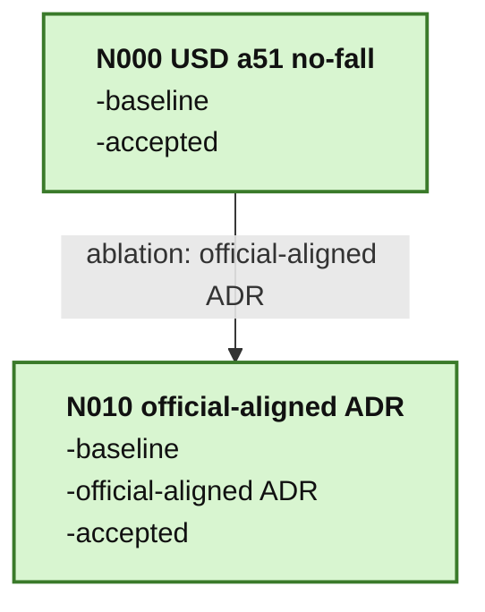

# Single Asset Training MAP

本图记录 AnyMani 当前单资产训练阶段的科研语义演化。这个阶段从已恢复并确认可用的 LEAP USD tactile a51 baseline 出发，后续逐步验证 official-style ADR/contact basin、URDF-only asset swap，并最终迁移到用户自己的 generated asset。

## Graph

## Node Index

| Node | Note | Status | Tags | 说明 |
| --- | --- | --- | --- | --- |
| N000 | [[图谱/single_asset_training/nodes/N000-usd-a51-nofall]] | accepted | `baseline`, `usd`, `a51-mdp`, `tactile` | LEAP USD tactile a51 no-fall baseline；后续 ADR、URDF-only 与 generated asset 迁移的父节点。 |
| N010 | [[图谱/single_asset_training/nodes/N010-official-aligned-adr]] | accepted | `baseline`, `official-aligned ADR`, `leap-hand`, `adr`, `official-parity` | AnyMani 中复刻官方 LEAP 训练 contract 的 official-aligned ADR 节点；前 300 epoch 已验证效果足够好，可作为后续长训主线。 |

## Candidate Next Directions

这些方向尚未作为正式节点记录。只有在实验完成、观察并复盘后，才由用户决定是否晋升为图节点。

| Candidate | Expected Parent | Edge Label | 要验证的科研问题 |
| --- | --- | --- | --- |
| USD + official-style ADR/contact basin | N000 | `ablation: ADR basin` | official LEAP 早期学习速度是否主要来自更友好的 early contact basin 与逐步扩展的 ADR。 |
| URDF-only asset swap | N000 | `ablation: URDF only` | 在 MDP/reward/action/training 不变时，URDF-backed LEAP articulation 是否保持 USD baseline 的学习与接触行为。 |
| URDF + ADR merge | TBD | `merge: URDF + ADR` | 在 URDF asset 和 ADR 分别被验证后，二者合并是否存在非线性交互或接触分布退化。 |

## Stage Invariants

当前阶段的主线推进原则是渐进式单变量变化：

- 每个新节点应清楚写出相对父节点的 `Δ`。
- 对照实验应显式写出保持不变的 MDP、reward、asset、reset distribution、training config。
- 破坏性变更可以记录为新分支，但不应与受控消融混在同一条边里。
- merge 节点必须写明两个父节点的已知证据，以及可能出现的交互项。
