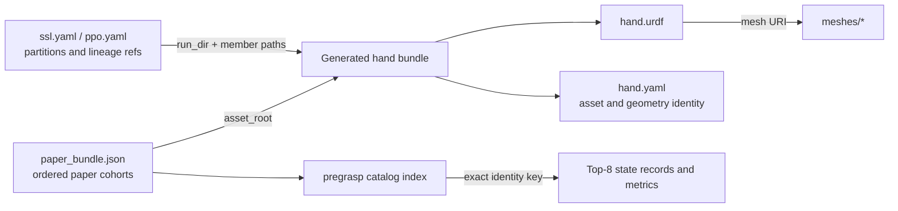

# Hand Assets

Commands in this guide run from the AnyMani repository root inside the active Python environment. When invoking Python modules under `source/anymani`, prefix commands with `PYTHONPATH=source/anymani`.

## Downloaded paper set

The default asset download (`python scripts/download.py --component assets`, ~7.9 MB) provides a curated set of 384 nominal hand bundles: 256 training hands (128 LEAP and 128 Allegro) and 128 strict held-out hands. In the held-out cohort, 123 hands have certified pregrasps, while five retain recorded initialization failures, yielding 379 ready hands in total. The separate 5.2 GB generated library is not required for policy replay or student training.

Download and inspect the cohort index:

```bash
python scripts/download.py --component assets
PYTHONPATH=source/anymani python - <<'PY'
from anymani.publication.paper_data import PaperAssetBundle

bundle = PaperAssetBundle("data/assets")
for name in bundle.manifest["cohort_order"]:
    cohort = bundle.cohort(name)
    print(name, f"{cohort['ready_count']}/{cohort['nominal_count']} ready")

training = bundle.resolve("leap_training")
print("loaded LEAP hands:", len(training.assets))
print("pregrasp catalog:", bundle.catalog_root("leap_training"))
PY
```

`paper_bundle.json` defines each cohort and its member ordering. Each entry identifies `hand.urdf`, `hand.yaml`, and their mesh dependencies within the package. Variants can share meshes with their parent hand. Pregrasp records are maintained in a separate cohort catalog and indexed by the exact hand, object, scale, physics, and search identities.

## How the files fit together

An asset dataset manifest (such as `ssl.yaml` or `ppo.yaml`) defines lineages and partitions within a generated asset run. The run directory holds each mother or variant bundle; `hand.urdf` defines kinematic links, joints, limits, and visual/collision mesh references; `hand.yaml` records provenance and typed geometry metadata; and the `meshes/` directory provides surface geometry. The pregrasp catalog stores certified grasp candidate poses and stability metrics indexed by hand identity.



## Generate new hand assets

To generate and resolve a single pre-made LEAP hand as a quick CPU-only test:

```bash
PYTHONPATH=source/anymani python -m anymani.assets.scripts.generate \
  --stage pre-made \
  --config-module anymani.assets.config.paper_asset_example \
  --max-enumerate 1 \
  --output-dir outputs/asset-example

PYTHONPATH=source/anymani python - <<'PY'
from pathlib import Path
from anymani.assets.bank import HandBank, HandBankCfg

selection = HandBank(HandBankCfg(
    source_mode="pre_made",
    selection_mode="all",
    pre_made_path=Path("outputs/asset-example"),
    require_sidecar=True,
    validate_mesh_relpaths=True,
    require_geometry_semantics=True,
)).resolve()
print(len(selection.assets), selection.assets[0].asset_id, len(selection.assets[0].mesh_refs))
PY
```

The example writes a timestamped bundle under `outputs/asset-example` without launching Isaac Sim.

To construct the full pre-made inventory, run the default generation recipe. It enumerates all configured hand topologies and connectivity presets:

```bash
PYTHONPATH=source/anymani python -m anymani.assets.scripts.generate \
  --stage pre-made \
  --config-module anymani.assets.config.asset_gen_cfg \
  --output-dir outputs/pre-made-inventory
```

```bash
python - <<'PY'
from pathlib import Path

source = Path("source/anymani/anymani/assets/datasets/cross_embodiment_balanced_v1/template.yaml")
output = Path("outputs/datasets/cross_embodiment_balanced_v1/template.yaml")
runs = sorted(Path("outputs/pre-made-inventory").glob("*/summary.yaml"), key=lambda path: path.stat().st_mtime)
if not runs:
    raise SystemExit("No generated run with summary.yaml was found.")
placeholder = "source/anymani/anymani/assets/generated/<premade_run>"
template = source.read_text()
if placeholder not in template:
    raise SystemExit("The template inventory.run_dir placeholder has changed.")
output.parent.mkdir(parents=True, exist_ok=True)
output.write_text(template.replace(placeholder, runs[-1].parent.as_posix(), 1))
print("dataset template:", output)
print("inventory run:", runs[-1].parent)
PY
```

The [dataset template](../source/anymani/anymani/assets/datasets/cross_embodiment_balanced_v1/template.yaml) is configured for a complete inventory rather than a single hand. The helper script above copies the template and updates `inventory.run_dir` to point to the latest run containing `summary.yaml`. The full specification requires 2,920 mother assets (1,460 canonical mirror pairs) and yields 11,264 assets across training, validation, and evaluation splits.

Planning locks random seeds and cohort partitions; building generates `ssl.yaml`, `ppo.yaml`, a build report, and mutated variant bundles. The full post-mutate build checks geometric clearance with the configured Warp/SDF validator and requires a compatible GPU environment:

```bash
DATASET_DIR=outputs/datasets/cross_embodiment_balanced_v1
PYTHONPATH=source/anymani python -m anymani.assets.scripts.dataset plan \
  --template "$DATASET_DIR/template.yaml" \
  --config-module anymani.assets.config.asset_gen_cfg \
  --lock-path "$DATASET_DIR/selection.lock.yaml"
PYTHONPATH=source/anymani python -m anymani.assets.scripts.dataset build \
  --template "$DATASET_DIR/template.yaml" \
  --config-module anymani.assets.config.asset_gen_cfg \
  --lock-path "$DATASET_DIR/selection.lock.yaml" \
  --workers 8 --resume
```

## Generate strict pregrasps for a new cohort

Generating strict pregrasps requires an Isaac Lab / PhysX simulation environment. Starting from the `ssl.yaml` and `ppo.yaml` manifests built above, select a source cohort, resolve canonical identities, and search for missing pregrasp entries.

Work is divided into shards of up to 16 hands. A geometric screen selects up to 32 of 256 Sobol proposals per hand for initial physics testing. Subsequent cross-entropy method (CEM) rounds add up to 128 candidates per unfinished hand. The pipeline writes source locks, canonical locks, preparation records, physics logs, and catalog entries under `outputs/`:

```bash
DATASET_DIR=outputs/datasets/cross_embodiment_balanced_v1
COHORT=leap-paper-extension
SOURCE_LOCK=outputs/cohorts/${COHORT}.lock.yaml
CANONICAL_LOCK=outputs/cohorts/${COHORT}.canonical.lock.yaml
CATALOG=outputs/pregrasp/catalogs/${COHORT}
PREPARATION=outputs/pregrasp/search/${COHORT}/preparation
EVIDENCE=outputs/pregrasp/search/${COHORT}/physics

PYTHONPATH=source/anymani python -m anymani.assets.scripts.cohort \
  --family leap --cohort-id "$COHORT" \
  --ppo-manifest "$DATASET_DIR/ppo.yaml" \
  --ssl-manifest "$DATASET_DIR/ssl.yaml" \
  --output "$SOURCE_LOCK"
PYTHONPATH=source/anymani python -m anymani.assets.scripts.finalize_cohort \
  --source-lock "$SOURCE_LOCK" --output "$CANONICAL_LOCK"
PYTHONPATH=source/anymani python -m anymani.pregrasp.scripts.prepare_cohort_pregrasp_shards \
  --cohort-lock "$CANONICAL_LOCK" --output-dir "$PREPARATION" \
  --shard-assets 16 --catalog "$CATALOG"

for LOCK in "$PREPARATION"/*.canonical.lock.yaml; do
  [ -f "$LOCK" ] || continue
  SHARD=$(basename "$LOCK" .canonical.lock.yaml)
  STATUS=0
  PYTHONPATH=source/anymani python -m anymani.pregrasp.scripts.generate_heterogeneous_mvp80_pregrasp_strict \
    --cohort-lock "$LOCK" --catalog "$CATALOG" \
    --evidence "$EVIDENCE/$SHARD" --max-cem-rounds 3 --seed 20260902 \
    --publish-passing-assets || STATUS=$?
  if [ "$STATUS" -ne 0 ] && [ "$STATUS" -ne 3 ]; then exit "$STATUS"; fi
done
```

The generator runs up to three CEM rounds for each hand that still lacks eight states satisfying the fixed strict gate. Exit code `3` reports partial cohort coverage (where certain hands failed to obtain eight passing states); any valid passing entries found are preserved in the catalog. While the script name references "MVP80" for historical reasons, `--cohort-lock` operates on the exact member count specified in the lock file.
