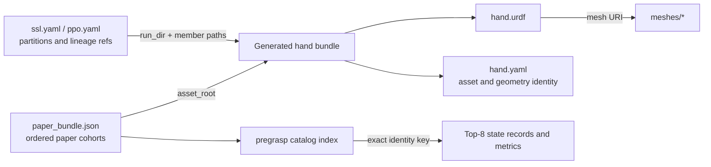

# Hand Assets

Run commands from the repository root in the AnyMani Python environment. Prefix source commands with `PYTHONPATH=source/anymani` so they use this checkout.

## Downloaded paper set

The default paper artifact is a curated, portable set of 384 hand bundles: 256 nominal training hands (128 LEAP and 128 Allegro) and 128 strict-unseen hands. The strict-unseen set has 123 certified pregrasp-ready members; five members remain in the nominal cohort with their failure records. The separate 5.2 GB generated-hand library is not included.

Download and inspect the cohort index:

```bash
python scripts/download.py --component assets
PYTHONPATH=source/anymani python - <<'PY'
from anymani.publication.paper_data import PaperAssetBundle

bundle = PaperAssetBundle("data/assets")
for name in bundle.manifest["cohort_order"]:
    cohort = bundle.cohort(name)
    print(name, f"{cohort['ready_count']}/{cohort['nominal_count']} ready")

training = bundle.resolve("leap_training")
print("loaded LEAP hands:", len(training.assets))
print("pregrasp catalog:", bundle.catalog_root("leap_training"))
PY
```

`paper_bundle.json` lists each cohort and its ordered members. A member points to one self-contained asset root with `hand.urdf`, `hand.yaml`, and every referenced mesh. Its optional pregrasp record is stored separately in the cohort catalog and is matched by the exact hand, object, scale, physics, and search identity.

## How the files fit together

An asset dataset manifest such as `ssl.yaml` or `ppo.yaml` selects lineages and partitions within a generated run. The run holds each mother or variant bundle; the URDF defines links, joints, limits, and mesh references; the sidecar records asset provenance and typed geometry identity. The mesh files provide the geometry referenced by the URDF. Pregrasp catalogs store certified candidate states and metrics separately, keyed to the corresponding hand identity.



## Generate new hand assets

For a small CPU example, generate and resolve one pre-made LEAP hand:

```bash
PYTHONPATH=source/anymani python -m anymani.assets.scripts.generate \
  --stage pre-made \
  --config-module anymani.assets.config.paper_asset_example \
  --max-enumerate 1 \
  --output-dir outputs/asset-example

PYTHONPATH=source/anymani python - <<'PY'
from pathlib import Path
from anymani.assets.bank import HandBank, HandBankCfg

selection = HandBank(HandBankCfg(
    source_mode="pre_made",
    selection_mode="all",
    pre_made_path=Path("outputs/asset-example"),
    require_sidecar=True,
    validate_mesh_relpaths=True,
    require_geometry_semantics=True,
)).resolve()
print(len(selection.assets), selection.assets[0].asset_id, len(selection.assets[0].mesh_refs))
PY
```

The example writes one timestamped bundle under `outputs/asset-example`; it does not start Isaac. To build the optional full pre-made inventory, run the default recipe instead. It enumerates every configured hand and connectivity preset and can create a large asset tree:

```bash
PYTHONPATH=source/anymani python -m anymani.assets.scripts.generate \
  --stage pre-made \
  --config-module anymani.assets.config.asset_gen_cfg \
  --output-dir outputs/pre-made-inventory
```

```bash
python - <<'PY'
from pathlib import Path

source = Path("source/anymani/anymani/assets/datasets/cross_embodiment_balanced_v1/template.yaml")
output = Path("outputs/datasets/cross_embodiment_balanced_v1/template.yaml")
runs = sorted(Path("outputs/pre-made-inventory").glob("*/summary.yaml"), key=lambda path: path.stat().st_mtime)
if not runs:
    raise SystemExit("No generated run with summary.yaml was found.")
placeholder = "source/anymani/anymani/assets/generated/<premade_run>"
template = source.read_text()
if placeholder not in template:
    raise SystemExit("The template inventory.run_dir placeholder has changed.")
output.parent.mkdir(parents=True, exist_ok=True)
output.write_text(template.replace(placeholder, runs[-1].parent.as_posix(), 1))
print("dataset template:", output)
print("inventory run:", runs[-1].parent)
PY
```

The [dataset template](../source/anymani/anymani/assets/datasets/cross_embodiment_balanced_v1/template.yaml) is sized for a full inventory, not the one-hand example. The helper above copies it and sets `inventory.run_dir` to the latest generated run containing `summary.yaml`. The template requires 2,920 mother assets (1,460 canonical mirror pairs) and publishes 11,264 final assets across train, validation, and evaluation. Planning freezes cohort membership and seeds; building writes `ssl.yaml`, `ppo.yaml`, a build report, and variant bundles. The full post-mutate build uses the configured Warp/SDF validator and requires a supported geometry/GPU environment.

```bash
DATASET_DIR=outputs/datasets/cross_embodiment_balanced_v1
PYTHONPATH=source/anymani python -m anymani.assets.scripts.dataset plan \
  --template "$DATASET_DIR/template.yaml" \
  --config-module anymani.assets.config.asset_gen_cfg \
  --lock-path "$DATASET_DIR/selection.lock.yaml"
PYTHONPATH=source/anymani python -m anymani.assets.scripts.dataset build \
  --template "$DATASET_DIR/template.yaml" \
  --config-module anymani.assets.config.asset_gen_cfg \
  --lock-path "$DATASET_DIR/selection.lock.yaml" \
  --workers 8 --resume
```

## Generate strict pregrasps for a new cohort

Strict pregrasp generation is a separate Isaac Lab/PhysX run. Start from the `ssl.yaml` and `ppo.yaml` produced above: select a source cohort, finalize its canonical identities, then prepare and search only the missing cache entries. Each default shard contains up to 16 hands. Initial screening evaluates 32 physics candidates per hand; subsequent CEM rounds add up to 128 candidates per unfinished hand. The commands write source locks, canonical locks, preparation records, physics evidence, and content-addressed catalog entries under `outputs/`.

```bash
DATASET_DIR=outputs/datasets/cross_embodiment_balanced_v1
COHORT=leap-paper-extension
SOURCE_LOCK=outputs/cohorts/${COHORT}.lock.yaml
CANONICAL_LOCK=outputs/cohorts/${COHORT}.canonical.lock.yaml
CATALOG=outputs/pregrasp/catalogs/${COHORT}
PREPARATION=outputs/pregrasp/search/${COHORT}/preparation
EVIDENCE=outputs/pregrasp/search/${COHORT}/physics

PYTHONPATH=source/anymani python -m anymani.assets.scripts.cohort \
  --family leap --cohort-id "$COHORT" \
  --ppo-manifest "$DATASET_DIR/ppo.yaml" \
  --ssl-manifest "$DATASET_DIR/ssl.yaml" \
  --output "$SOURCE_LOCK"
PYTHONPATH=source/anymani python -m anymani.assets.scripts.finalize_cohort \
  --source-lock "$SOURCE_LOCK" --output "$CANONICAL_LOCK"
PYTHONPATH=source/anymani python -m anymani.pregrasp.scripts.prepare_cohort_pregrasp_shards \
  --cohort-lock "$CANONICAL_LOCK" --output-dir "$PREPARATION" \
  --shard-assets 16 --catalog "$CATALOG"

for LOCK in "$PREPARATION"/*.canonical.lock.yaml; do
  [ -f "$LOCK" ] || continue
  SHARD=$(basename "$LOCK" .canonical.lock.yaml)
  STATUS=0
  PYTHONPATH=source/anymani python -m anymani.pregrasp.scripts.generate_heterogeneous_mvp80_pregrasp_strict \
    --cohort-lock "$LOCK" --catalog "$CATALOG" \
    --evidence "$EVIDENCE/$SHARD" --max-cem-rounds 3 --seed 20260902 \
    --publish-passing-assets || STATUS=$?
  if [ "$STATUS" -ne 0 ] && [ "$STATUS" -ne 3 ]; then exit "$STATUS"; fi
done
```

The generator preserves the fixed strict gate and searches 256 Sobol proposals, then up to three CEM rounds of 128 candidates for each asset that still lacks eight passing states. Exit status `3` reports incomplete cohort coverage; any complete passing entries are still available in the catalog for later admission. The historical script name includes “MVP80,” but `--cohort-lock` mode uses the lock's member count and supports other cohort sizes.
