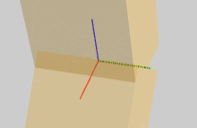
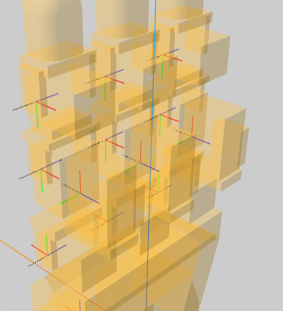

1. 从urdf提取极简运动学树
2. 规模化生存资产的方法论（由我主导）(某种意义上相当于“数据清洗”这一机器学习领域的上游工作)
   - 难点之一: <inertial> 的计算（资产生成）
   > 在实际工程中，为了防止物理引擎（如 Gazebo, PyBullet）在计算微小物体时出现除以接近 0 的数值导致崩溃，开发者经常会故意把 inertial 的值写得比实际大一些（这被称为 Inertia Padding 惯性填充）
   - 坐标系语义对齐？主要是不同<joint>和child link的<collision>坐标系（网络架构）
   - 难点之二：我们怎么才能确保生成的资产不仅物理合理而且分布多样？足以再后续训练中提升模型的泛化能力？
3. recolored urdf区分不同的手指link，从base/palm的树根节点开始，同层级的link color mesh颜色相同
4. 新想法：旋转轴附近加 cyliner mesh（可选）
   
5. mesh 提取特征的现实考虑。并不是所有mesh都有用（参与物理仿真的有效性）。例如leaphand背后那坨电机mesh,在手背一侧，几乎不和物体发生交互，很难说它的形状特征对模型学习有帮助。这点需要在后续网络架构设计上考虑
   
6. 貌似关节级构建器没必要细分声明式配置类和运行时类，会显得很臃肿（后续待定），采用 `@dataclass + classmethod` 会更好？
7. 关于物理合理性：主要是和inertial字段有关，需要找到真实的质心、计算围绕新质心的惯性矩阵，而不是质心和 joint frame 单纯重合。因为在 URDF 中，<inertia> 矩阵最好是相对于**质心（Center of Mass）**来定义；但这样一来，joint frame之间的边特征 se3 对于网络架构输入，则值得考量。
8. 关于 leaphand 官方urdf近似为 AnyMani/source/anymani/anymani/assets/hands/leap_hand/leap_hand_right.urdf 的猜想，是否采用了什么简化技术？