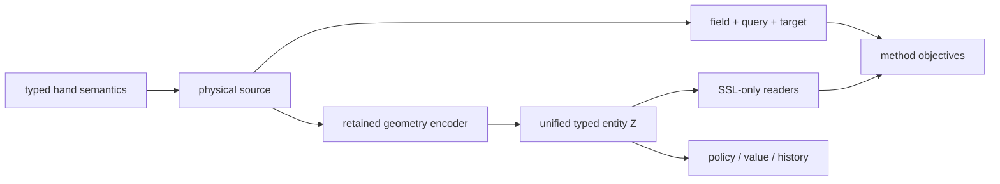

# AnyMani Distill

不同灵巧手即使执行同一个任务，也不会共享相同的关节数、运动链、碰撞表面或动作坐标。直接把这些差异压成固定长度 observation，容易让策略记住某一只手的索引布局，而不是学习“这只手在当前构型下能够如何接触和运动”。`distill` 研究的正是这一中间层：如何从手型与当前构型提取跨 embodiment 可比较、又保留绝对几何尺度和局部运动方向的表示，并把它迁移到后续策略学习。

## 从手型到可迁移状态

记手型的静态物理定义为 $\mathfrak m$，当前活动关节角为 $q\in\mathbb R^{N_J}$。AnyMani 不把原始 URDF link 当作学习实体，而是依据资产 sidecar 中经过审核的语义，把碰撞几何组织成 PALM、JOINT 与 TIP owners。第 $g$ 个 owner 的当前表面记为 $\mathcal S_{\mathfrak m,g}^{h}(q)$；它同时对应模型中的第 $g$ 个 entity 与场解码轴。由此，手指数、链长与自由度可以变化，而物理角色和张量语义保持一致。

当前主线以逐 owner unsigned distance 为基础：

$$
d_g(x;q)=\inf_{y\in\mathcal S_{\mathfrak m,g}^{h}(q)}\|x-y\|_2,
$$

其中 query $x$ 固定在手部语义坐标系 `{h}`，长度单位为 m。训练并不要求部署模型直接输出距离，而是用多尺度 Gaussian 邻近场

$$
\rho_{\sigma,g}(x;q)=\exp\!\left(-\frac{d_g(x;q)^2}{2\sigma^2}\right)
$$

监督 configuration-level latent。当前一阶主线使用固定 collision material points 相对 PALM anchors 的关系 Jacobian

$$
\Gamma_{gmki}(q)=\frac{\partial}{\partial q_i}
\left[\mathrm{height},\mathrm{radius},\mathrm{dot},\mathrm{chirality}\right]_{gmk}
\quad [\mathrm{rad}^{-1}]
$$

监督 joint-sensitive 信息。ρ 描述“当前表面在哪里”，Gamma 描述“固定表面物质点沿某个关节运动时，相对掌部 landmark 布局如何流动”；二者共同约束同一组 PALM/JOINT/TIP typed entity tokens，而不是产生彼此独立的零阶/一阶 latent。

## 方法分解

这一研究命题被拆成四个相互独立、可分别证伪的层次。

`representations` 定义物理对象。它从资产提供的 typed geometry semantics lower 出 simulator-independent POE/FK/Jacobian 与 owner collision union，再组合 field、query measure 与 privileged target。稠密 padding 上限由 method 从 resolved 资产推导。这里没有神经网络，也不读取 optimizer、epoch 或任务状态。

`models` 定义部署表示。多锚点前端把 home surface、空间旋量和 query 都表达为相对完整 anchor constellation 的关系；graph-biased encoder-only Transformer 在全手 entities 间传播上下文，其 final-norm tokens 直接形成统一 $Z\in\mathbb R^{B\times G\times128}$。训练期 FiLM readers 从 owner/JOINT view 还原场值，SSL 后整体删除。

`methods` 把 representation、model 与双 objective 装配成对外封闭的科学方法。当前主线联合 density 与显式 Gamma；旧 density/κ method 保留为 v0.7.5 研究对照。Joint-sign rewrite 是输入增强，不是附加主损失。两项保留各自单位、mask、teacher baseline 和 $(asset,q)$ 等权归约，共享 encoder 由 FairGrad 更新。

`ssl`、`rl` 与 `il` 定义生命周期。stage 可以更换 sampling、优化与评估协议，但不能复制或悄悄改写上述物理语义。当前 Geometry SSL 与 rl_games 路线可运行；IL 仍只是边界定义。



## 信息边界为何重要

retained encoder 只允许读取当前物理 $q$ 与静态手型证据：$q_{home}$、ordered screws、topology、真实 home boundary、palm normal 与无序 physical anchors。current distance、closest point、surface Jacobian、query stratum、contact、object state、action 和 future state 都是 privileged 或 task-specific 信息，不能进入这条路径。否则重建误差可能降低，但得到的是训练时答案泄漏，而不是可部署几何表示。

同样，坐标不变性必须与物理差异分开。`{h}` 绕 palm normal 的面内 $SO(2)$ 选择是 gauge；reflection/chirality 不是。joint-axis sign rewrite 只改变坐标约定，因此可观测 density 应保持不变，对应 selected Gamma column 与同坐标动作应变号；统一 latent 本身不施加人为的奇偶分解。模型与测试分别处理这些命题，避免用含糊的“frame robustness”掩盖错误不变性。

## 已有证据与结论边界

当前 deterministic contracts 覆盖 semantic lowering、FK/Jacobian、owner union、anchor/query/sigma provenance、$SO(2)$ 与 joint-sign rewrite、graph-bias lookup、FiLM 条件、跨结构 padding、schema 9 Python composition、双 objective 的 baseline-normalized 归约、streamed update、epoch-boundary checkpoint resume 和 standalone retained artifact。synthetic geometry integration 已闭合到 objective backward；真实 CUDA/Warp integration 由运行环境条件决定。

在 NVIDIA GeForce RTX 5070 Ti 上，canonical retained encoder 以 $B=4096$、20 次预热和 50 次 CUDA Event 测得 median 17.844 ms、p95 18.275 ms，满足 40 ms 子预算。该结果只说明从 GPU-resident q/static evidence 到统一 $Z$ 的子路径达标；它排除了 decoder、policy、Isaac Sim 与 `env.step`，不能外推为完整 20 Hz 控制系统已经闭合。完整计时统计由 [`models/README.md`](models/README.md) 解释。

N031 已完成 8192-asset、12-cycle 正式训练与两条 1024-asset × 64-q held-out suites：density skill 约 `72%`，Gamma 约 `86%`，PGS@4mm,80% 约 `99.99%`。PPO transfer、official zero-shot 与 Isaac pose parity 仍属于后续阶段，不能由 SSL 重建 skill 代替。

## 阅读与运行

物理定义见 [`representations/README.md`](representations/README.md)，方法聚合根见 [`methods/README.md`](methods/README.md)，网络与 retained/disposable 边界见 [`models/README.md`](models/README.md)，预训练协议见 [`ssl/README.md`](ssl/README.md)，实验统计见 [`diagnostics/README.md`](diagnostics/README.md)，rl_games 路线见 [`rl/README.md`](rl/README.md)。

```bash
# task-free Geometry SSL 正式入口；开发试跑只覆盖预算，不改变模型/teacher/objective
python -m anymani.distill.ssl.pretrain --config geometry_ssl_density_material_jacobian_v0_8_0 --max_epochs 2 --num_minibatches 1 --assets_per_minibatch 64 --q_per_asset_per_minibatch 8 --mini_epochs 1 --microbatch_size 64 --seed 20260830

# GM rl_games
/home/hac/isaac/IsaacLab/isaaclab.sh -p -m anymani.distill.rl.train --task AnyMani-GM-SingleAsset-MLP-v0 --num_envs 4096 --headless
```

`tasks/inhand` 的历史路线继续使用仓库根 `scripts/rl_games/train.py` / `play.py`，不与 `distill.rl` 合并入口。
