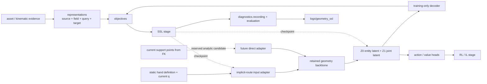

# AnyMani Distill

`distill` 是 AnyMani 面向跨手型策略学习的训练与模型层。它消费 `tasks` 已经定义好的环境接口，组织
RL、可运行的几何自监督预训练与未来模仿学习，同时让物理表征、可学习模型和数学目标保持可独立替换。

这里的 `distill` 不只表示 teacher-student 蒸馏，也包括共享表示学习和 policy training。资产生成、robot
spawn、reward、reset 与 PhysX 生命周期仍分别属于 `assets`、`robots` 和 `tasks`。

## 当前状态

| 部分 | 状态 | 当前含义 |
| --- | --- | --- |
| RL | **可运行** | 现有 `distill.train/play` 与 `scripts/rl_games/` 入口；本次 geometry SSL 不迁移其生命周期 |
| [`models/`](models/README.md) | 可运行主线 + 候选 scaffold | geometry encoder、SSL-only decoder、tactile temporal baseline，以及 SSL/RL/IL 共用边界 |
| [`representations/`](representations/README.md) | 可运行主线 + 候选 scaffold | Warp geometry field、50/25/25 query、$d/\rho/\kappa/g$ target 与候选物理表征 |
| [`ssl/`](ssl/README.md) | **可运行** | 在线 Sobol q/target、跨结构 padding、Hydra 入口、fixed validation、日志与 checkpoint |
| `il/` | 不可运行 scaffold | 未来 BC、DAgger 与 teacher-student distillation 生命周期 |
| `objectives/` | 可运行主线 + scaffold | geometry SSL 五项联合目标与未来 RL objective |
| [`diagnostics/`](diagnostics/README.md) | 部分可运行 | geometry SSL recording、query-only/latent-shuffle 与可选 Warp/Kaolin 对照；通用 analysis 仍待实现 |
| [`doc/spec/`](doc/spec/README.md) | 工程规范 | 当前隐式场工程规范与阅读入口；`doc/` 其他图像不是 executable contract |

目录或模块名存在不代表对应实现已经完成。首版预训练协同使用逐归属体多带宽 $\rho$、距离灵敏度
$\kappa=\nabla_qd$、由 $\kappa$ 派生的 $g=\nabla_q\rho$、同一密度预测器的 Sobolev/JVP 自导数与链式一致性；
独立 $D_g$ 是正式候选但默认关闭。当前实现主线是多锚点 Gaussian 条件隐式场；解析直接压缩只保留为
后续公平对照候选，本轮不为它伪造同等成熟的 pipeline。

## 科学数据流



核心边界是：

1. `representations` 定义网络应保真的物理对象，不定义神经网络；
2. route-specific input adapter、shared backbone 与 $z^{(0)}/z_i^{(1)}$ heads 构成 retained geometry encoder，预训练后迁入 PPO；
3. representation decoder 默认只在训练期存在，不进入部署 forward；
4. stage 目录负责编排，不复制共享模型；
5. `tasks` 拥有 MDP，`distill` 不通过 wrapper 改写 observation、action、reward 或 reset 语义。

## 可运行 RL 入口

在仓库根目录执行：

```bash
source /home/hac/isaac/env_isaaclab/bin/activate

/home/hac/isaac/IsaacLab/isaaclab.sh -p -m anymani.distill.train \
  --task AnyMani-GM-SingleAsset-MLP-v0 \
  --num_envs 4096 \
  --headless
```

```bash
/home/hac/isaac/IsaacLab/isaaclab.sh -p -m anymani.distill.play \
  --task AnyMani-GM-SingleAsset-MLP-v0 \
  --num_envs 1 \
  --checkpoint /absolute/path/to/checkpoint.pth \
  --real-time
```

`tasks/inhand` 的既有 rl_games 路线仍使用仓库根 `scripts/rl_games/train.py` 与 `scripts/rl_games/play.py`，不要把两套入口误写成统一 CLI。未来若把 GM 入口迁入 `rl/`，必须把新模块、文档和调用方放在同一提交。

## 可运行 Geometry SSL 入口

在仓库根目录激活普通 AnyMani/Isaac Lab Python 环境后运行；该进程不启动 Isaac Sim：

```bash
python -m anymani.distill.ssl.pretrain \
  'assets.train_paths=[/absolute/path/to/generated/hand_bundle]'
```

CLI 当前通过显式路径 manifest 接收 pre-made mother、post-mutate variants 与跨 family/generated 不同 DOF bundles；`HandBank` 自身也支持 `pre_made` discovery 与 `mixed` manifest，但这两个 collection mode 尚未作为 SSL CLI 字段暴露。

## SSL 配置与证据边界

`ssl/config/` 提供冻结 dataclass 与 Hydra/OmegaConf bridge；当前执行入口是 `ssl/pretrain.py`，`ssl/experiments/` 与 `ssl/runtime/` 仍只是未来 ownership。训练通过 `diagnostics/recording/` 把 manifest、resolved config、TensorBoard、JSONL/NPZ 证据与 checkpoint 写入 `logs/geometry_ssl/<experiment>/<UTC timestamp>/`；`diagnostics/analysis/` 仍是只读扩展边界。

## 部署与验证约束

- RTX 5070 Ti、$B=4096$、单结构组下，隐式主线完整在线 retained path 的快速 suite 使用 20 次预热与
  50 次 CUDA Event 计时，要求 p95 不超过 40 ms；未来若激活解析直接候选，同一门槛必须计入批量
  FK/刚体支撑点变换；离线 cache materialization、decoder、policy 与 Isaac Sim 均排除；
- morphology-only raw 静态量应缓存，不在每个 policy step 重建 mesh；PPO full fine-tune 时不得缓存 stale
  learned activation；
- 纯公式、tensor shape、mask、routing 与 cache contract 使用普通 pytest；
- 依赖 Isaac Sim、USD、PhysX handle 或完整 reset/step 生命周期的命题使用显式 runtime smoke；
- 正式 checkpoint 至少记录代码 commit、asset version、task/obs/action schema、训练配置与评估协议。

## 阅读路径

1. 先读本页确定 active 与 future 边界；
2. 运行已有 PPO 时从本页的入口和对应 task/agent 配置开始；
3. 研究共享网络时读 [`models/README.md`](models/README.md)；
4. 研究 physical-field target 时读 [`representations/README.md`](representations/README.md)；
5. 研究 pretrain-to-PPO 生命周期时读 [`ssl/README.md`](ssl/README.md)；
6. 研究 run 证据与分析时读 [`diagnostics/README.md`](diagnostics/README.md)；
7. 查工程规范时读 [`doc/spec/README.md`](doc/spec/README.md)。

更完整的 GM 实现现状见 [`../../docs/GM_TEACHER_IMPLEMENTATION_OVERVIEW.md`](../../docs/GM_TEACHER_IMPLEMENTATION_OVERVIEW.md)。
