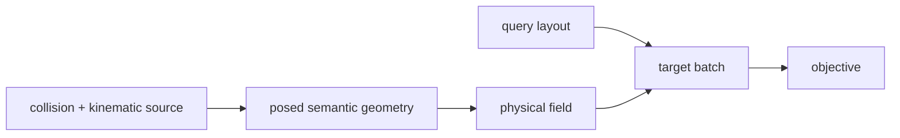

# Physical Representations

`representations` 定义跨手型训练需要保真的**物理真值**。它回答“当前手在空间中是什么几何对象，以及在哪些位置读取什么物理量”，但不拥有 neural encoder、decoder、policy 或 optimizer。

## 研究对象

当前可运行主线从手型静态物理定义 $\mathfrak m$、hand semantic frame `{h}`、关节构型 $q$、有序运动链与基准碰撞几何出发，构造当前构型下的 posed collision geometry。经过审核的结构模式包含 $N_E$ 个 PALM/JOINT/TIP 物理实体；第 $g$ 个实体同时是第 $g$ 个碰撞表面归属体，实体索引、归属轴与 SSL 解码轴直接同索引，但不要求与原始 URDF link 或 PhysX rigid body 一一对应。

## 首版物理场与一阶监督合同

hand frame `{h}` 只固定有向 palm normal $z_h=n_p$；其 origin 选择与绕 $n_p$ 的 $x_h/y_h$ 选择都是坐标 gauge，不承载 palm center、thumb-side 或 finger-side 学习语义。位置参照来自 finger-mount 邻域内、经过 palm collision solid/contact-facing 过滤的 physical anchors。任一 spatial query 或 geometry element 同时相对完整 anchor constellation 表达，而不是一根 finger 只绑定一个 anchor；全局 hand-frame origin 和 $x/y$ gauge 的共同重写不应改变预测物理量。

设 $x\in\mathbb R^3$ 是求构型导数时固定于 `{h}` 的 SSL query point，单位 m；$q\in\mathbb R^{N_J}$ 是按运动链顺序排列的当前活动关节角，单位 rad；$\mathcal S_{\mathfrak m,g}^{h}(q)$ 是第 $g$ 个归属体的 current posed collision surface。逐归属体 unsigned distance 为：

$$
d_g(x;q)
=
\inf_{y\in\mathcal S_{\mathfrak m,g}^{h}(q)}
\|x-y\|_2,
$$

其单位为 m。对物理带宽 $0<\sigma_1<\cdots<\sigma_L$，zeroth-order target 是无量纲 Gaussian 邻近场：

$$
\rho_{\sigma_\ell,g}(x;q)
=
\exp\!\left[
-\frac{d_g(x;q)^2}{2\sigma_\ell^2}
\right].
$$

距离灵敏度是 query-to-surface distance 对全部活动关节坐标的梯度：

$$
\kappa_g(x;q)
=
\nabla_q d_g(x;q)
\in\mathbb R^{N_J},
$$

其第 $i$ 个分量 $\kappa_{g,i}=\partial d_g/\partial q_i$ 的单位为 m/rad。Gaussian 场灵敏度为：

$$
g_{\sigma_\ell,g}(x;q)
=
\nabla_q\rho_{\sigma_\ell,g}(x;q)
=
-\frac{d_g(x;q)}{\sigma_\ell^2}
\rho_{\sigma_\ell,g}(x;q)
\kappa_g(x;q),
$$

其中 $g_{\sigma_\ell,g}\in\mathbb R^{N_J}$，单位为 $\mathrm{rad}^{-1}$。这一关系把 configuration-level geometry state 与 local differential geometry 绑定起来：$Z^{(0)}$ 应足以解码逐归属体 $\rho$；第一版 residual $f_i^{screw}$ 一阶 head 输出的 $z_i^{(1)}$ 由 $D_\kappa$ 读取 $\kappa_{g,i}$；再由 $\hat\rho$、$\hat\kappa$ 与链式法则得到 $\hat g^{(\kappa)}$，并与教师 $g$ 和同一密度预测器的 $\hat g^{auto}$ 对齐。直接从 $z_i^{(1)}$ 读取 $g$ 的独立 $D_g$ 是正式候选，第一版默认关闭而不是从研究空间删除。

当前主线是多锚点 Gaussian 条件隐式路线。解析直接压缩保留为后续公平对照候选：它共享 PALM/JOINT/TIP 归属、锚点与类型化 $Z^{(0)}/z_i^{(1)}$ 下游接口，但本轮 scaffold 只记录“可读取缓存支撑点经当前 FK 得到的 physical points”这一边界，不提前设计其完整 adapter、dataset 或训练 pipeline。

uniform scale 验收同时缩放 geometry、query、anchor 与带宽：$x'=\lambda x$、$\mathcal S'=\lambda\mathcal S$、$\sigma'=\lambda\sigma$，而关节角 $q$ 不变。此时 $d'=\lambda d$，所以 $\rho'=\rho$、$g'=g$，但 $\kappa'=\lambda\kappa$。若保持米制 $\sigma$ 不变而只改变几何，$\rho$ 会变化；实现和评估不能把这两种尺度实验混为同一个 invariance claim。

物理 entity/owner 语义包括：

- `PALM`：静态 palm-owned geometry；
- `JOINT`：该关节物理实体所拥有的 collision surface、运动学属性与 $z_i^{(1)}$ routing；
- `TIP`：distal/tip posed geometry。

当前密度监督保持逐归属体、逐显式 sigma 输出 `[B,G,N_Q,N_sigma]`，不训练独立 whole-hand union head。decoder 对每个 `(owner,query,sigma)` 使用同一个 scalar reader，$N_\sigma$ 不是固定输出头宽度。若需要联合诊断，只能在共同查询网格上从逐归属体预测解析派生，并明确它不是新的物理监督目标。

这些分组仍是实验 contract，不是所有资产已经完成审核的事实。official LEAP/Allegro 等资产需要 collision 可视化、人工检查、versioned sidecar 与 coverage/no-duplicate validation 后才能进入正式 target pipeline。

## 正交分解

| 子目录 | 问题 | 当前内容 |
| --- | --- | --- |
| `sources/` | 物理证据从哪里来？ | collision pieces、semantic ownership、kinematics、posed geometry、static cache |
| `fields/` | 每个空间点返回什么量？ | $d_g$、$\rho_{\sigma,g}$、$\kappa_g$、$g_{\sigma,g}$ 与 field-specific composition |
| `queries/` | 在哪里读取 field？ | 可运行的 50/25/25 workspace/owner-shell/adjacent sampler，以及候选 fixed ordered BPS |
| `targets/` | 怎样形成监督 batch？ | 可运行的 Warp closest-surface 与 $d/\rho/\kappa/g$ target，以及其他候选 routing |

因此，下列组合不是互斥的单体算法：

- posed BPS = 某个 field + fixed ordered queries；
- conditional implicit field = 某个 field + sampled queries + training-only decoder；
- parametric Gaussian field = decoder 输出有限 Gaussian components，再在 query space 比较其诱导 field。

## Field catalog 与当前优先级

首版默认实验协同训练逐归属体多带宽 $\rho$、显式距离灵敏度 $\kappa$、由 $\kappa$ 派生的 $g$、同一密度预测器的 Sobolev/JVP 自导数以及链式一致性。组件目录中已有 SDF、TSDF、surface KDE、explicit Gaussian components 等属于 prior scaffold 或后续消融边界；目录存在不表示它们与主线同优先级，也不得让 trainer 自动选择其中任意一个。

每个 field 必须声明：

- domain、frame 与空间单位；
- inside/outside、truncation、scale 与 normalization；
- collision primitive/mesh、watertightness 与来源 provenance；
- composition operator。SDF union 可以使用 `min`，density/occupancy 不得无依据照搬同一规则；
- 对真实空间变换应保持什么不变或等变。

parametric Gaussian 没有唯一 component-level target，因此默认在 query space 比较 induced field，避免把
component permutation 当成监督错误。

## Source 与 cache

source 层应保留 primitive/mesh truth，并按 capability 暴露 surface sampling、unsigned distance、inside/outside、
signed distance、scale 与 watertightness。推荐静态 cache + online query：把当前 query 变换到缓存的 local
geometry，而不是每个 batch 重建或移动 mesh。

动态 command、contact、object state、history 与当前 posed-field label 不属于纯 geometry source 的最小输入。
它们可以进入下游 policy observation，但不能因为 policy 需要就泄漏到 SSL partial input。

## Gauge、hand axes 与 physical anchors

`{h}` 只固定有向 palm normal $n_p=z_h$；其 origin 和绕 $n_p$ 的 $x/y$ basis 都不提供可学习的类人手方向标签。physical anchors 必须附着于 mount-conditioned palm surface/interior support，不能直接使用 raw URDF joint origin。对同一 query $x^h$ 与 anchors $C^h=\{c_k^h\}_{k=1}^{K}$，all-anchor relation $\{x^h-c_k^h\}$ 在 origin 共同平移后保持不变；对共同的 $R_\theta\in SO(2)$ gauge rotation，$Z^{(0)}$、$z_i^{(1)}$ 与 scalar-coordinate field outputs 保持不变。reflection/chirality 不是 gauge，不能被同一不变性删除。

对逐 JOINT 成对坐标符号改写，$Z^{(0)}$ 与 $\rho$ 为偶，$z_i^{(1)}$、$\kappa_{g,i}$、$g_{\sigma,g,i}$ 与同坐标动作输出为奇。一阶路径必须读取 $f_i^{screw}$ 或 encoder tangent 等合法符号奇载体，不能从完全符号偶的 $Z^{(0)}$ 凭空恢复非零奇输出。

link-local URDF gauge、joint-axis sign/zero rewrite、`{h}` origin rewrite 与 `{h}` 的 $SO(2)$ basis rewrite 是不同命题。physical posed surface、ordered screw evidence、all-anchor relation 与 paired-gauge sample 分别提供验收证据，不能把它们合并成一个含义模糊的“frame robustness”指标。

无论采用 canonicalization、paired re-gauging、relative features 或 equivariant model，target batch 都必须保存
足够的 frame、unit、semantic group、mask 与 provenance，使同一物理机构的等价表达可以被测试。相关文献先例与未决边界由独立 research dossier 维护，不作为源码依赖。

## 边界与验证

- 不 import `torch.nn`，不持有 checkpoint；
- learnable adapter/backbone/decoder 位于 [`../models/`](../models/README.md)；
- scalar loss 位于 `../objectives/`，stage orchestration 位于 `../ssl/`、`../rl/`、`../il/`；
- 纯公式、gauge pair、semantic coverage、query/target shape 与 cache key 使用 deterministic contract test；
- heavy target generator 可以只用于预训练；RTX 5070 Ti、$B=4096$、单结构组下，隐式主线完整在线
  $X\rightarrow(Z^{(0)},\{z_i^{(1)}\})$ 要求 50 次计时 p95 不超过 40 ms。未来若激活解析直接候选，
  同一门槛必须包含批量 FK/刚体支撑点变换；离线 cache materialization、decoder、policy 与 Isaac Sim 不计入。
